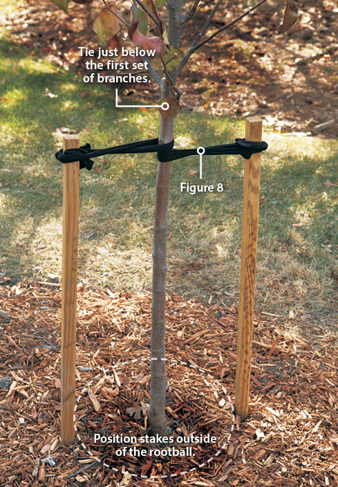
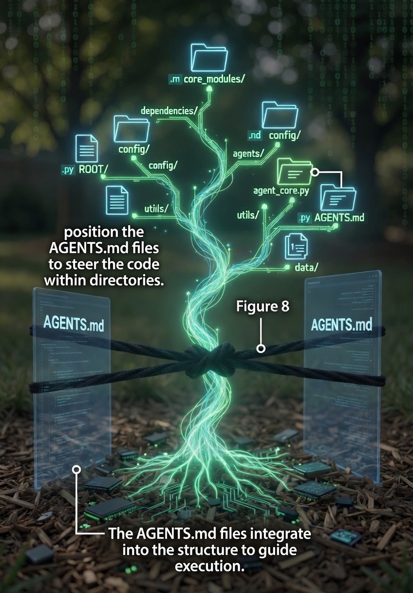

# Agentic Engineering

Turning a codebase agents *can't* work in
into one they *can*

  Juan Cruz Fortunatti

---
layout: intro
---

# Juan Cruz Fortunatti

Agentic AI Engineer @ Delivery Hero

building multi-agent systems for restaurants & agentic evals

coffee nerd · passionate about coding and building stuff

  ledeluge.me
  <carbon-logo-x class="text-base" /> jcfortunatti

---
layout: center
class: text-center
---

# What is agentic engineering?

It's not about the prompt.

the system around the model

  

    
Context

    
docs & plans

  

  

    
Constraints

    
tests

  

  

    
Feedback

    
evals & screenshots

  

same model, different engineering

---

# Vibe coding vs. agentic engineering

### 🎲 Vibe coding

prompt → accept → ship

you **eyeball** the output

ground truth: **vibes**

optimizes for the **demo**

### 🛠️ Agentic engineering

prompt → plan → verify ↻ → merge

you review the **plan & diff**

ground truth: **tests & evals**

optimizes for the **diff you'd merge**

One question tells them apart: <strong>"where's the ground truth the agent checks itself against?"</strong>

---
layout: center
class: text-center
---

## Why legacy code resists agents

It's missing three things:

Direction
A safety net
Feedback

So we add them back, in that order.

---
layout: section
---

# First · Plan it

before any move

---
layout: center
class: text-center
---

# Build the plan, in three phases

  

    
Understand

    
map + diagram

  

  

    
Decide

    
options + standards

  

  

    
Iterate

    
review + refine

  

<pre class="inline-block text-sm font-mono opacity-70 text-left leading-tight m-0">
┌─────────┐    ┌────────┐    ┌──────────┐
│  pages  │───►│  api   │───►│  prisma  │
└─────────┘    └────────┘    └──────────┘
</pre>

ask for ASCII diagrams of current + target flows

→ <code>PLAN.md</code>, the north star for the four moves

---
layout: section
---

# Move 1 · Pin it

tests before anything moves

---
layout: center
class: text-center
---

# Pin the behavior, then change it

snapshot what the code does <strong>today</strong>, bugs and all

then refactor freely, the tests catch any drift

🔴 &nbsp; <strong>Live:</strong> a test goes red. intended change, or regression?

---
layout: section
---

# Move 2 · Tutor it

`.md` files as the **target** the code grows toward

---

# A tutor keeps growth straight

In the garden, a **tutor** is a stake you tie a young tree to
so it grows **straight** instead of crooked.

It doesn't grow the tree.
It **steers the direction** of growth.

---
layout: center
---

# Same idea, for your codebase

`AGENTS.md` / `CLAUDE.md` are tutors for your repo.

They describe the **target** shape of each folder.
The migration moves the code toward them.

Tool-agnostic: `AGENTS.md` is the open standard, `CLAUDE.md` is what Claude Code reads. The tutor is the idea; the filename is just which gardener reads the label.

---
layout: center
---

# Two ways to plant a tutor

### 🌰 Seed it

Greenfield project.
Plant the tutor **with** the seed →
it grows straight from day one.

### 🌳 Stake a grown tree

Legacy codebase.
The tutor sets the target.
The next migration steers toward it.

🔴 &nbsp; **Live:** seed `hacker-prode`'s target tutors

---
layout: section
---

# Move 3 · Migrate

converge on the tutors, module by module

---
layout: center
class: text-center
---

# Migrate, module by module

each PR moves one slice toward its tutor

the <strong>tests</strong> prove nothing broke

small enough that the human can review the diff

🔴 &nbsp; <strong>Live:</strong> a module converges. tests verify. diff reviewed.

---
layout: section
---

# Move 4 · Give it eyes

Close the feedback loop

---
layout: center
class: text-center
---

# The agent can't fix what it can't see

by default, it's typing <strong>blind</strong>

a harness gives it eyes: screenshots, a running app

now a redesign is safe to hand off

🔴 &nbsp; <strong>Live:</strong> screenshot → restyle → screenshot again

---
layout: center
class: text-center
---

# Q&A

---
layout: section
---

# Your turn

30 minutes, in small groups

---

# Pick a move and try it

### 📌 Pin
Write one characterization test.

**Done =** it goes green, then catches a change.

### 🌱 Tutor
Write an `AGENTS.md` for a module: the **target** shape.

**Done =** 1 target convention + 1 retained warning.

### 🔁 Migrate
Apply one tutor convention to one module.

**Done =** tests stay green, diff fits one PR.

### 👁️ Eyes
Restyle one screen with a screenshot loop.

**Done =** before / after, agent-driven.

Or introduce a small feature using any of the four.
Then come back and tell us **what surprised you.**

---
layout: center
class: text-center
---

vibe coding trusts the output

agentic engineering

verifies it

the engineering is the scaffolding that makes verification automatic

---
layout: center
class: text-center
---

# thanks

  ledeluge.me
  ·
  <carbon-logo-x class="text-base" /> jcfortunatti

